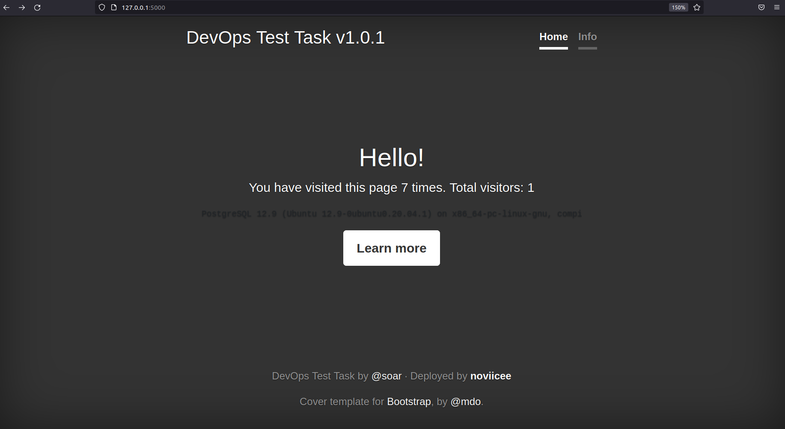
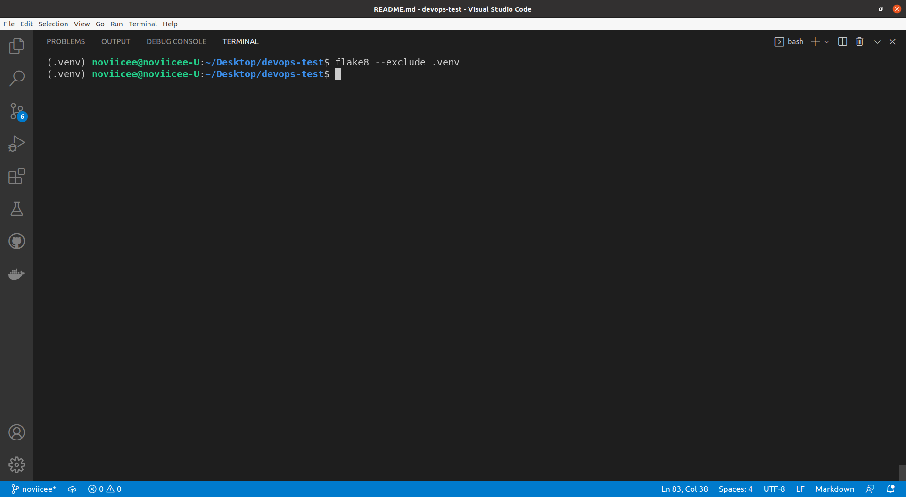
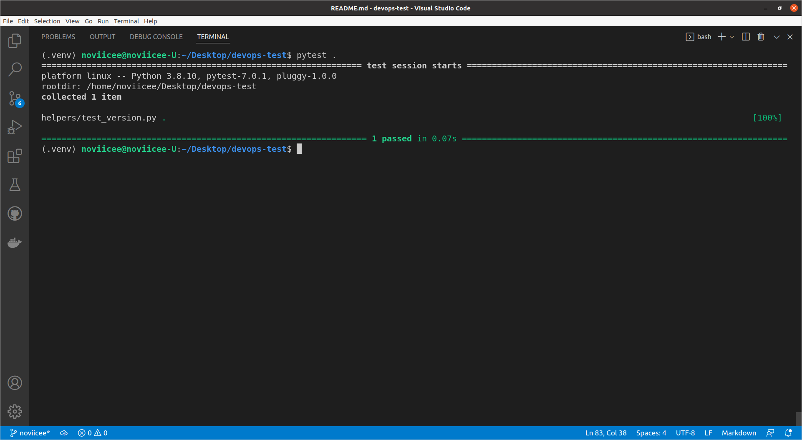
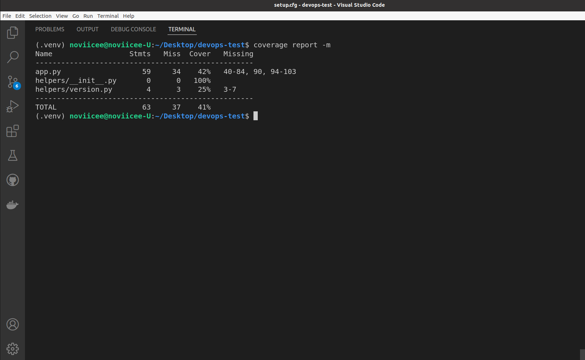
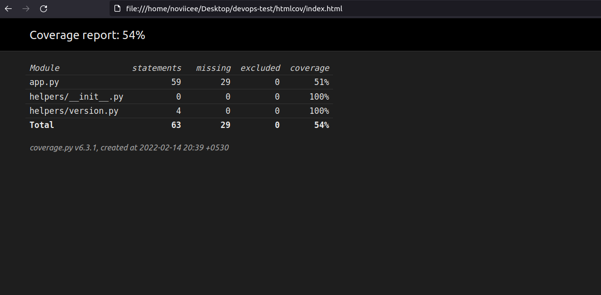

# Introduction

This is a pretty simple Python application which counts the unique visitors on the website, and shows the statistic.

This application is written in [Python](https://www.python.org/) using [Flask](https://flask.palletsprojects.com/en/2.0.x/) as framework. It uses [PostegreSQL](https://www.postgresql.org/) to store the number of visitors on the webpage.

## Tools and Technologies Used

 
    
     
     
     
     

## Requirements:

- Python `3.x` 
- PostgreSQL server
- Packages listed in `requirements.txt` 

## Installation

To install the application several steps should be completed:

- Prepare PostgreSQL database
- Install all required packages with `pip install -r requirements.txt`
- Set all required [environment variables](#configuration)
- Apply all migrations with `flask db upgrade`

**My Setup**
 
I generally like to create a virtual environment for every project as per it's requirements. 
This is because using virtaul environment help decouple and isolate versions of Python and associated pip packages. This allows end-users to install and manage their own set of packages that are independent of those provided by the system.

For this application, I have created the *python-virtual environment* for *Python 3.8.10* 

You can also do so by executing the following commands-  
1. `pythonx -m venv <name of your venv>`; x=version of python required
2. `source <name of your venv>/bin/activate`

To exit out of the virtual-environment, simply run- 
    `deactivate`

## Starting the Application

- Start application

*For starting the application, I have used `python3 app.py`, but you can use different approaches - just choose one from [official docs](http://flask.pocoo.org/docs/1.0/deploying/#deployment).*

 

**Running Demo of the application:**

*Running Demo*

*The application is currently set to run on port:5000*.

# Application Description

This app has some endpoints:

- `/` - main page with all data shown
- `/version` - JSON response with current app version
- `/healthz` - JSON response with status of the application

## Files description

- `migrations` - directory with database migrations (see _Installation_) based on `alembic`
- `static` - just static files for serving UI
- `templates` - HTML template for main page
- `app.py` - main "executable" which contains all code
- `requirements.txt` - list of all Python packages needed to run app
- `requirements.test.txt` - list of all Python packages needed for CI/CD tasks
- `version.txt` - text file with current version

## Configuration

As any Docker-ready application - It can be easily configured via environment variables. So, here is a list of them:

- `DATABASE_URL` (required) - connection string to your database. (It is used to connect to the databse for counting the unique number of visitors).
- `USER_NAME` - your name, which will be shown on the page.
- `USER_URL` - some kind of your personal URL, which will be directed to, from your user name

# The Task

## Infrastructure

- [x] Start all related servers/instances/logical units
- [x] Make required changes in OS
- [x] Install Docker (or any other kind of containerization software)

    * *OS: Ubuntu 20.04.3 LTS*
    * *Docker: version 20.10.12*
    * *Docker-Compose: version 1.29.2*

## Containerisation

* *I have made use of Docker and included a [Dockerfile](Dockerfile).*

**Dockerfile**
- [x] Choose base image
- [x] Include all [installation steps](#installation)
- [x] Make this app run and listen on HTTP interface
- [x]Entrypoint: Used to set executables that will always run when the container is initiated.
- [x] Healthcheck: You'll see the container's healthiness in the STATUS column when you run docker ps 

**The Image**

1. Build the image. 
`docker build -t <image-name> . (-t is the tag command)`

2. Run the image.  
`docker run -d -p 5000:5000 <image-name>`; *(d-detach, p-expose to port from_container -> to_host)*

- [x] Prepare `docker-compose.yml` for whole app stack, which can be used by developers

*Just execute  `docker-compose up` and your application would be up and running in no time.*  
*This is another advantage of using containerisation as 
we are free from the hectic task of developing code in a specific computing environment which, when transferred to a new location, may result in bugs and errors. We can just share images and our application would be up and running on our local machine in no time.*

## Analysis 

All tools required for this section are in [requirements.test.txt](requirements.test.txt) file.  
They can be easily used with `pip install -r requirements.test.txt`.

- [x] Lintering
    - [x] Code style 
        I have used [flake8](https://pypi.org/project/flake8/) to check the coding style. 
          

        *Command: `flake8 --exclude .venv`*  
        *Here I have excluded the ./venv directory while checking for flake8 coding style because there is no need to scan that folder*

    - [x] Static typing 
        This project can be verified with [mypy](https://mypy.readthedocs.io/en/stable/) static types checker, configuration for it can be found in `setup.cfg`

- [x] Tests 
    There are no so many tests, but you can run them with `pytest .` and get successful results 
    

- [x] Code coverage 
    I have used the Python [Coverage](https://coverage.readthedocs.io/en/6.3.1/) project, to check for the code-coverage.

    * *Use `coverage report -m` to get the coverage report on your terminal.*

    

    * *Or for a nicer presentation, use `coverage html`. This command will write the coverage report to _htmlcov/index.html_*  
    Then after open _htmlcov/index.html_ in your browser, to see a report like so.

    

## CI/CD

Automating the project.

*I have used [Github Actions](https://docs.github.com/en/actions) for Continuous Integration (CI).*

Also,

- [ ] Database Migrations 
    Application should perform DB migrations (as described above) on each deployment to update schema for new code.

- [x] Versioning 
    Current project version can be seen in file `version.txt` and it will be shown as version on web-page.
    What about adding build number to this version and auto-increment it on each build?

    *I have added build number 01 to this version of the appplication (check tags) and have created the [github-workflow](.github/workflows/main.yml) to get trigger on each `deployment` and auto-increment the tag number on each build.*

    * *Pushing the application to heroku?*
    
## Monitoring

*I have developed the `healthz` checkpoints, which allows the users to check the status of the application.*
*It can be accessed on `\healthz` [endpoint](#application-description).*

## Fixes?
